# 【AWS メモ⑤】VPC Peering を使用して VPC 間の EC2 同士を接続する


## VPC Peering でできること

・異なるVPC間を直接接続することができる。（VPC同士を直接接続する技術なのでVPC間の接続にEC2にパブリックIPを割り振る必要がない）

・アカウントが異なる場合にも接続できる。（アカウントが異なる場合、ペアリング認証時に接続先 VPCのアカウントでの承諾する必要）

・複数のVPCとの接続ができる。


## VPC Peering でできないこと

・CIDRが一致または重複するVPC間の接続はできない。

・ペアリング先のVPCがペアリングしているVPCに直接接続はできない。

　→ 接続するには、VPC-AからVPC-Bへ接続後、VPC-Cへ接続する必要がある。（NAT等も同様）


## 環境

以下の条件の AWS 環境で VPC Peering を確立する。


・VPC は VPC-A と VPC-B の二つ

・VPC-A 、VPC-B はそれぞれ subnet-a、subnet-b サブネットを持ち、EC2が1台ずつ起動している

・subnet-a には クライアント端末からの SSH 接続のみ有効とするセキュリティグループを設定

・subnet-b には 全ての接続を遮断するセキュリティグループを設定（のちにsubnet-aからの接続のみ許可する設定を付与）


イメージ

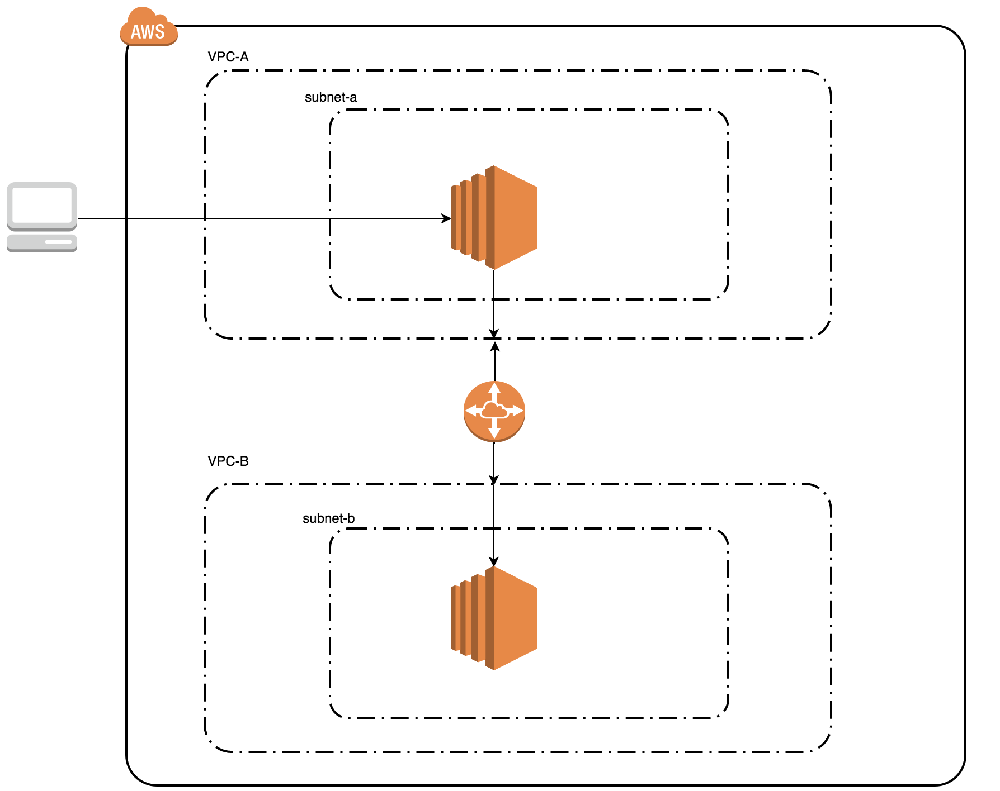


## VPC Peering の作成

サービスから VPC を選択して、 VPC画面遷移後、左端のメニューから 「ピアリング接続」を選択する。

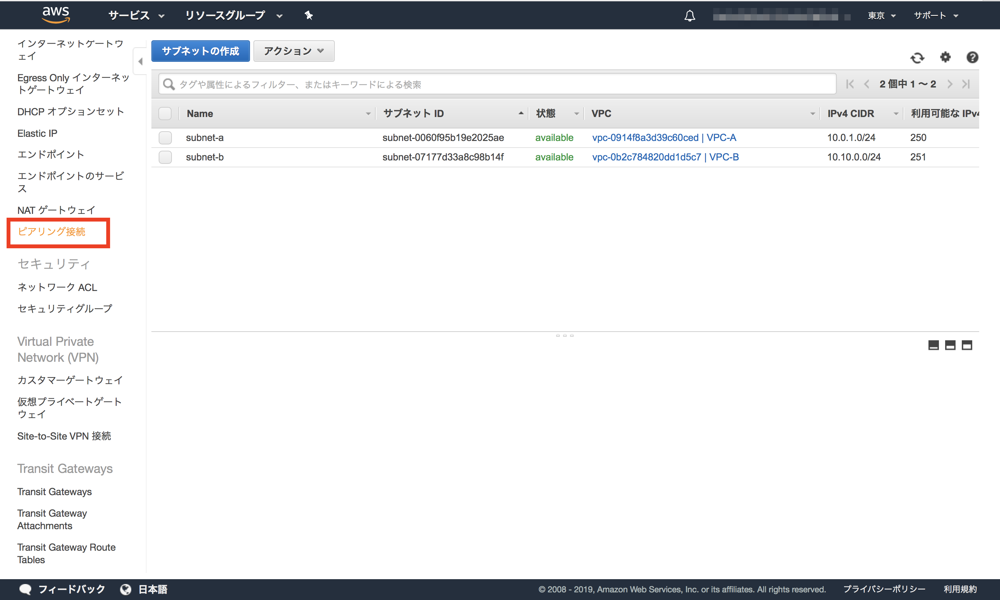


「ピア接続の作成」を押下する。

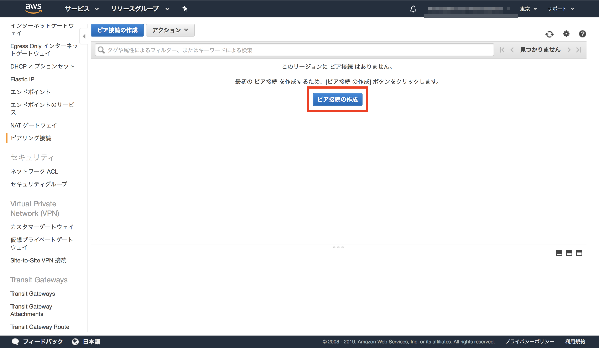


ボタンを押下すると、ピア接続作成画面に遷移するので、

各項目に設定値を入れていく。

・ピア接続ネームタグ・・・EC2などにあるTagを同じ

・VPC(リクエスタ)　  ・・・VPC間の接続許可を申請する側のVPC（ここではVPC-Aを設定）

・アカウント　　　　・・・許可する側のアカウント

・リージョン　　　　・・・今回は同じリージョンなので「このリージョン」を選択

・VPC(アクセプタ)　   ・・・VPC間の接続を許可する側のVPC（ここではVPC-Bを設定）


設定完了後、「ピア接続の作成」を押下する。

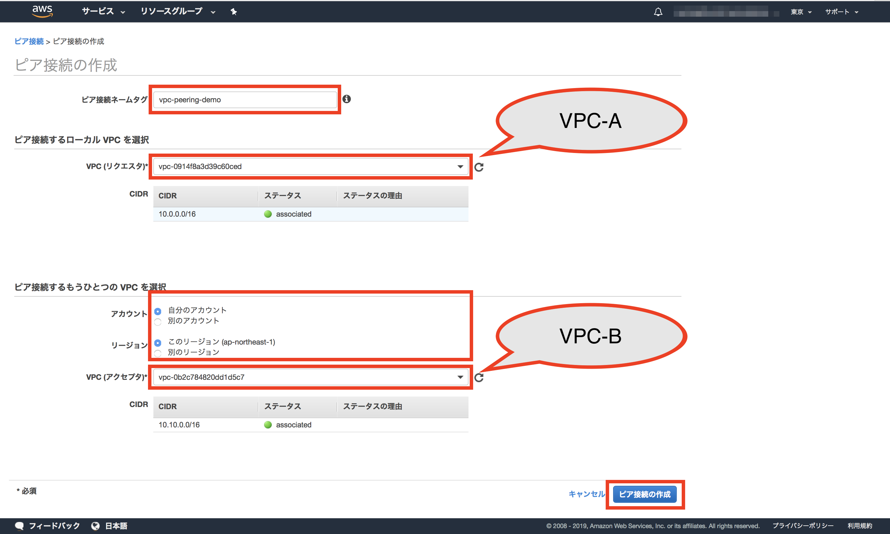


接続の作成が完了すると、承諾待ちのピア接続が作成される。

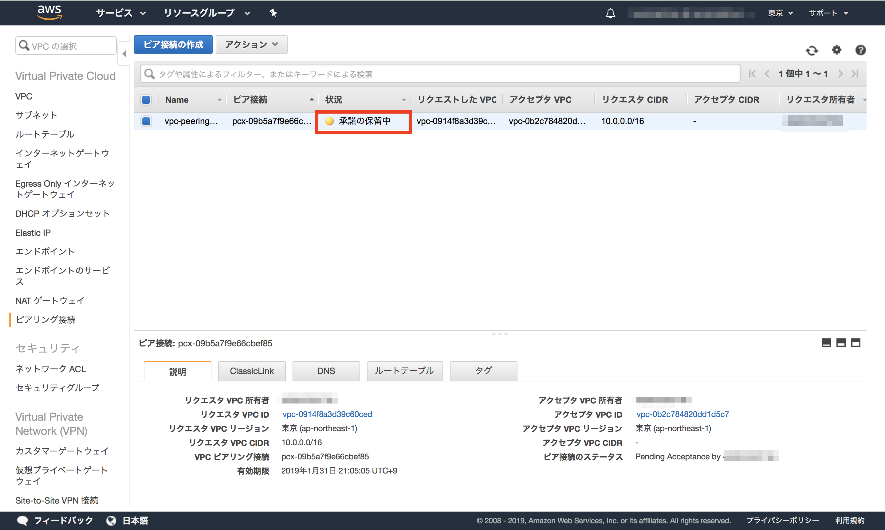


アクションタブから「リクエストの承諾」を選択するとピア接続が確立する。

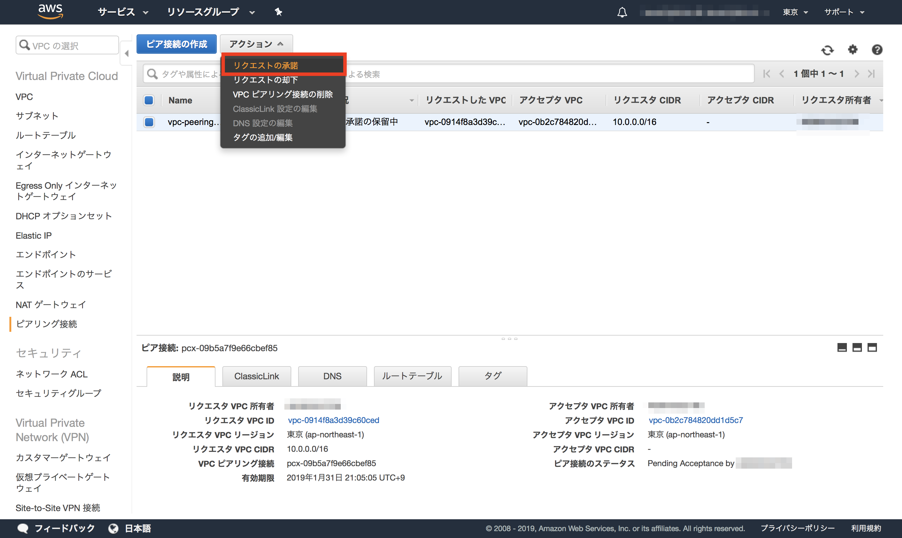

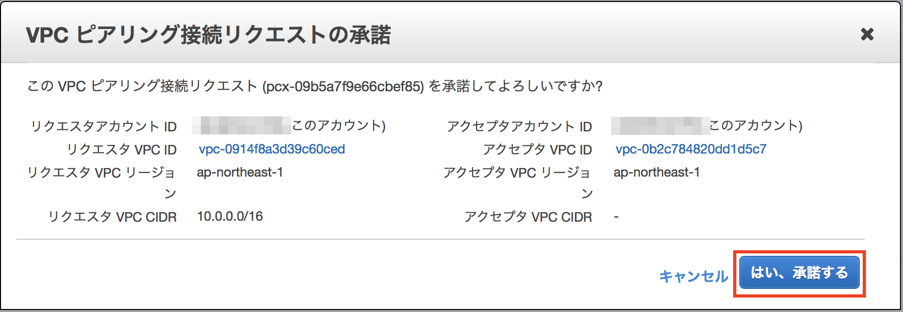

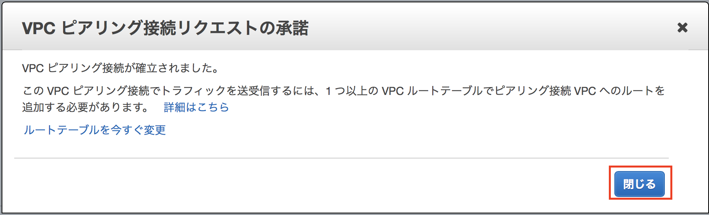


VPC-Aのルートテーブルには、送信先に VPC-BのCIDRを入力。
ターゲットには VPCペアリング接続を選択（Peering Connectionを選ぶとペアリングの候補がでる）

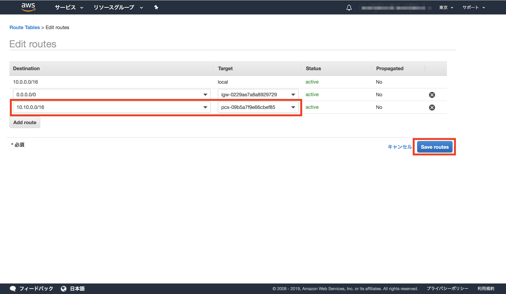


VPC-Bのルートテーブルには、送信先に VPC-AのCIDRを入力。

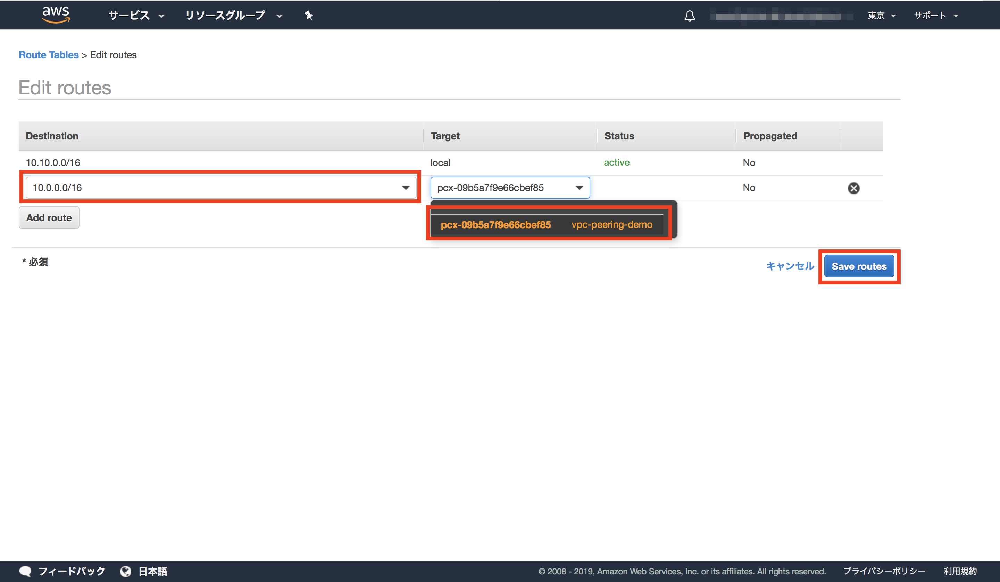


次に、subnet-bに設定されているセキュリティグループに VPC または subnet からの接続を許可する設定を行う必要がある。
なるべく細かくした方がいいと思うのでsubnet 単位で設定。

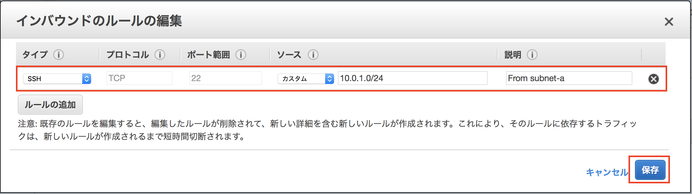


## 接続の確認

インターネットからの接続ができる VPC-A の EC2 に接続

```
# 作業端末から接続
$ ssh -i access.pem ec2-user@<EC2-AのパブリックIP>
```


VPC-Aの EC2 から VPC-B の EC2 に接続

```
# EC2-AからEC2-Bへの接続
$ ssh -i access.pem ec2-user@<EC2-BのプライベートIP>
```

